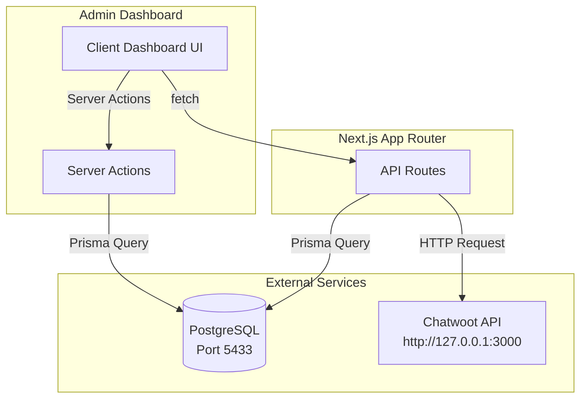

# Design Document: Comprehensive Client Dashboard

## 1. Overview

This document specifies the technical design for the comprehensive client dashboard refactor. The feature rebuilds the existing client management views into a unified, powerful control center that provides a single-page view where all client data and configurations are immediately visible and editable.

### 1.1 Design Goals

- **Unified Interface**: Single-page dashboard with Credentials, Bot AI Prompt, and Recent Chats sections
- **Real Data Integration**: Fetch from PostgreSQL (Business, AutoRule, AdminNote, ActivityLog) and Chatwoot API
- **Graceful Degradation**: Dashboard remains functional when partial data sources fail
- **Centralized Code**: All UI, data-fetching, and layout code in large centralized files per requirements
- **Enhanced Overview**: Client overview list with stats, service status, and activity

### 1.2 Scope

This design covers:
- Client detail page (`admin/clients/[id]/page.tsx`) refactor
- Client overview page (`admin/page.tsx` / OverviewClient.tsx) enhancement
- API routes for Chatwoot integration and data mutation
- Server Actions for form submissions

---

## 2. Architecture

### 2.1 System Architecture Overview



### 2.2 Data Flow

1. **Page Load**: Client detail page triggers parallel data fetching
   - Fetch Business record from PostgreSQL
   - Fetch conversations from Chatwoot API (if credentials valid)

2. **Data Mutation**: User edits form fields and submits
   - Server Action or API route validates input
   - Prisma updates Business record
   - UI reflects updated data

3. **Error Recovery**: Individual section failures show localized errors
   - Other sections continue functioning
   - Retry controls available per section

### 2.3 Component Structure

Following the requirement for centralized files, the dashboard is organized as:

```
src/app/admin/clients/[id]/
├── page.tsx              # Main dashboard (800+ lines)
│   ├── CredentialsSection      # Chatwoot credentials form
│   ├── BotAIPromptSection      # AI prompts and config form
│   ├── RecentChatsSection      # Chatwoot conversations list
│   └── TabContainer            # Account/Bot/Activity/Notes tabs
```

---

## 3. Components and Interfaces

### 3.1 Main Dashboard Component

```typescript
// src/app/admin/clients/[id]/page.tsx

type Business = {
  id: string
  name: string
  email: string
  plan: string
  status: string
  trialEndsAt: string | null
  chatwootAccountId: number | null
  chatwootApiToken: string | null
  businessInfo: BusinessInfo | null
  autoRules: AutoRule[]
  activityLogs: ActivityLog[]
  adminNotes: AdminNote[]
}

type BusinessInfo = {
  aiPrompt?: string
  aiTone?: string
  aiFaqs?: Array<{ q: string; a: string }>
  routingRules?: Array<{ condition: string; action: string }>
}

type Conversation = {
  id: number
  status: string
  lastMessage: {
    content: string
    createdAt: string
  }
  contact: {
    id: number
    name: string
  }
}

type DashboardState = {
  business: Business | null
  conversations: Conversation[]
  loading: { credentials: boolean; botConfig: boolean; chats: boolean }
  errors: { credentials: string | null; botConfig: string | null; chats: string | null }
  saving: boolean
}
```

### 3.2 Server Actions

```typescript
// In-page Server Actions

'use server'
async function updateCredentials(
  clientId: string,
  data: {
    chatwootAccountId?: number
    chatwootApiToken?: string
  }
): Promise<{ success: boolean; error?: string }>

async function updateBotConfig(
  clientId: string,
  data: {
    aiPrompt?: string
    aiTone?: string
    aiFaqs?: Array<{ q: string; a: string }>
    routingRules?: Array<{ condition: string; action: string }>
  }
): Promise<{ success: boolean; error?: string }>

async function toggleAutoRule(
  ruleId: string,
  active: boolean
): Promise<{ success: boolean; error?: string }>

async function addAdminNote(
  clientId: string,
  content: string
): Promise<{ success: boolean; note?: AdminNote; error?: string }>
```

### 3.3 API Routes

```typescript
// GET /api/admin/clients/[id]
// Returns: Business with all relations

// PATCH /api/admin/clients/[id]
// Body: Partial<Business>
// Returns: Updated Business

// GET /api/admin/chatwoot/conversations?accountId=<id>&token=<token>
// Returns: Array<Conversation>

// POST /api/admin/clients/[id]/notes
// Body: { content: string }
// Returns: Created AdminNote
```

### 3.4 Chatwoot API Integration

```typescript
// Chatwoot API Client
const CHATWOOT_BASE = 'http://127.0.0.1:3000'

async function fetchConversations(
  accountId: number,
  apiToken: string
): Promise<Conversation[]> {
  const response = await fetch(
    `${CHATWOOT_BASE}/api/v1/accounts/${accountId}/conversations`,
    {
      headers: {
        'Authorization': `Bearer ${apiToken}`,
        'Content-Type': 'application/json',
      },
    }
  )
  
  if (!response.ok) {
    throw new Error(`Chatwoot API error: ${response.status}`)
  }
  
  const data = await response.json()
  return data.payload.map((conv: any) => ({
    id: conv.id,
    status: conv.status,
    lastMessage: {
      content: conv.messages?.[0]?.content || '',
      createdAt: conv.messages?.[0]?.created_at || conv.updated_at,
    },
    contact: {
      id: conv.contact?.id,
      name: conv.contact?.name || 'Unknown',
    },
  }))
}
```

---

## 4. Data Models

### 4.1 Database Schema (from Prisma)

```prisma
model Business {
  id                   String       @id @default(cuid())
  name                 String
  email                String       @unique
  chatwootAccountId    Int?         @unique
  chatwootApiToken     String?
  plan                 Plan         @default(FREE)
  status               String       @default("TRIAL")
  trialEndsAt          DateTime?
  businessInfo         Json?        // Stores AI prompt, tone, FAQs, routing rules
  createdAt            DateTime     @default(now())
  updatedAt            DateTime     @updatedAt
  
  autoRules            AutoRule[]
  adminNotes           AdminNote[]
  activityLogs         ActivityLog[]
}

model AutoRule {
  id                   String       @id @default(cuid())
  businessId           String
  name                 String
  trigger              Trigger
  conditions           Json
  action               Action
  responseTemplate     String
  active               Boolean      @default(true)
  createdAt            DateTime     @default(now())
  updatedAt            DateTime     @updatedAt
}

model AdminNote {
  id          String   @id @default(cuid())
  businessId  String
  content     String
  createdAt   DateTime @default(now())
}

model ActivityLog {
  id          String   @id @default(cuid())
  businessId  String?
  action      String
  metadata    Json?
  createdAt   DateTime @default(now())
}
```

### 4.2 businessInfo JSON Structure

```typescript
type BusinessInfo = {
  // Bot AI Prompt Configuration
  aiPrompt?: string           // Main system prompt for AI
  aiTone?: string            // Tone: 'professional' | 'friendly' | 'casual'
  
  // FAQs
  aiFaqs?: Array<{
    q: string                // Question
    a: string                // Answer
  }>
  
  // Routing Rules
  routingRules?: Array<{
    condition: string        // e.g., "contains:pricing"
    action: string          // e.g., "route_to:support"
  }>
  
  // Additional config
  welcomeMessage?: string
  fallbackResponse?: string
}
```

---

## 5. Error Handling

### 5.1 Error Handling Strategy

The dashboard implements **graceful degradation** where each section operates independently:

```typescript
type SectionError = {
  message: string
  retry: () => void
  isRetryable: boolean
}

type DashboardErrors = {
  credentials: SectionError | null
  botConfig: SectionError | null
  chats: SectionError | null
}
```

### 5.2 Error Scenarios and Responses

| Scenario | Affected Section | Response | User Action |
|----------|------------------|----------|-------------|
| PostgreSQL query fails | All sections | Show global error banner | Retry button |
| Chatwoot API timeout | Recent Chats | Display error message in section | Retry button |
| Invalid credentials | Recent Chats | Show "Configure credentials" prompt | Edit credentials |
| Save operation fails | Form section | Show inline error, preserve form state | Retry save |
| Network disconnect | All sections | Show offline indicator | Auto-retry on reconnect |

### 5.3 Error UI Components

```typescript
// Error Banner Component
function ErrorBanner({ 
  message, 
  onRetry 
}: { 
  message: string 
  onRetry: () => void 
}) {
  return (
    <div className="bg-red-50 border border-red-200 rounded-lg p-4 mb-4">
      <div className="flex items-center gap-2 text-red-700">
        <AlertCircle size={16} />
        <span className="text-sm font-medium">{message}</span>
      </div>
      <button 
        onClick={onRetry}
        className="mt-2 text-sm text-red-600 hover:text-red-800 underline"
      >
        Réessayer
      </button>
    </div>
  )
}

// Section Loading State
function SectionLoader() {
  return (
    <div className="animate-pulse bg-gray-100 h-32 rounded-lg" />
  )
}
```

### 5.4 Retry Logic

```typescript
// Exponential backoff retry
async function fetchWithRetry<T>(
  fetchFn: () => Promise<T>,
  maxRetries = 3
): Promise<T> {
  let lastError: Error
  
  for (let attempt = 1; attempt <= maxRetries; attempt++) {
    try {
      return await fetchFn()
    } catch (error) {
      lastError = error as Error
      const delay = Math.min(1000 * Math.pow(2, attempt), 5000)
      await new Promise(resolve => setTimeout(resolve, delay))
    }
  }
  
  throw lastError!
}
```

---

## 6. UI Layout Structure

### 6.1 Dashboard Page Layout

```
┌─────────────────────────────────────────────────────────────────┐
│ Header: Client Name, Status Badge, Plan Badge, Back Link       │
├─────────────────────────────────────────────────────────────────┤
│ [Compte] [Bot Config] [Activité] [Notes]                       │
├─────────────────────────────────────────────────────────────────┤
│                                                                 │
│  ┌─────────────────────┐  ┌─────────────────────────────────┐  │
│  │  CREDENTIALS        │  │  BOT AI PROMPT                  │  │
│  │  ─────────────────  │  │  ─────────────────────────────  │  │
│  │  Account ID: [___]  │  │  System Prompt:                 │  │
│  │  API Token:  [___]  │  │  ┌───────────────────────────┐  │  │
│  │                     │  │  │                           │  │  │
│  │  [Save Credentials] │  │  │  Textarea with AI prompt  │  │  │
│  └─────────────────────┘  │  │                           │  │  │
│                           │  └───────────────────────────┘  │  │
│                           │  Tone: [Dropdown]               │  │
│  ┌─────────────────────┐  │  FAQs: [Add/Edit FAQ items]    │  │
│  │  RECENT CHATS       │  │  Routing: [Add rules]          │  │
│  │  ─────────────────  │  │                                 │  │
│  │  [Loading...] or    │  │  [Save Configuration]          │  │
│  │  [Error + Retry] or │  │  └─────────────────────────────────┘  │
│  │  Conversation List  │  │                                    │
│  │  - Contact Name     │                                        │
│  │    Last message...  │                                        │
│  │    2 min ago        │                                        │
│  │  - Contact Name     │                                        │
│  │    ...              │                                        │
│  └─────────────────────┘                                        │
│                                                                 │
└─────────────────────────────────────────────────────────────────┘
```

### 6.2 Tab Structure

| Tab | Content | Data Source |
|-----|---------|-------------|
| Compte | Profile info, credentials, actions | Business table |
| Bot Config | AutoRules, AI configuration | AutoRule table, businessInfo JSON |
| Activité | Activity log entries | ActivityLog table |
| Notes | Admin notes list + add form | AdminNote table |

### 6.3 Client Overview Page Layout

```
┌─────────────────────────────────────────────────────────────────┐
│ Header: "Vue d'ensemble" + Global Status Badge                  │
├─────────────────────────────────────────────────────────────────┤
│ ┌──────────┐ ┌──────────┐ ┌──────────┐ ┌──────────┐            │
│ │ Total    │ │ MRR      │ │ Trials   │ │ Pending  │            │
│ │ Clients  │ │          │ │ Expiring │ │ Config   │            │
│ └──────────┘ └──────────┘ └──────────┘ └──────────┘            │
├─────────────────────────────────────────────────────────────────┤
│ ┌───────────────���──────────┐ ┌──────────────────────────────┐  │
│ │ Services Status          │ │ Plan Distribution            │  │
│ │ ─────────────────────    │ │ ─────────────────────────    │  │
│ │ ● Bot WhatsApp: Online   │ │ [FREE  ████████░░ 45%]       │  │
│ │ ● Chatwoot: Online       │ │ [STARTER ████░░░░ 25%]       │  │
│ │ ● n8n: Online            │ │ [PRO     ██░░░░░░ 15%]       │  │
│ │ ● Marketing: Offline     │ │ [BUSINESS █░░░░░░ 15%]       │  │
│ └──────────────────────────┘ └──────────────────────────────┘  │
├─────────────────────────────────────────────────────────────────┤
│ Recent Activity                                                 │
│ ─────────────────────────────────────────────────────────────   │
│ Client A - Action description - 5 min ago                       │
│ Client B - Action description - 1 hour ago                      │
└─────────────────────────────────────────────────────────────────┘
```

---

## 7. Testing Strategy

### 7.1 Why Property-Based Testing Does Not Apply

This feature is primarily a **UI-driven application** with:
- External API integrations (Chatwoot)
- Database CRUD operations
- UI rendering and layout
- Form handling with validation

Property-based testing is inappropriate for:
- **UI rendering**: Use snapshot tests and visual regression tests
- **External API integration**: Use integration tests with mocked responses
- **Database CRUD**: Use example-based integration tests
- **Form validation**: Use edge-case unit tests

### 7.2 Test Types

#### Integration Tests

```typescript
// tests/integration/client-dashboard.test.ts

describe('Client Dashboard Integration', () => {
  it('fetches business data from PostgreSQL', async () => {
    // Setup: Create test business in database
    const business = await prisma.business.create({
      data: { /* test data */ }
    })
    
    // Act: Call API endpoint
    const response = await fetch(`/api/admin/clients/${business.id}`)
    const data = await response.json()
    
    // Assert
    expect(response.status).toBe(200)
    expect(data.id).toBe(business.id)
    expect(data.autoRules).toBeDefined()
    expect(data.adminNotes).toBeDefined()
  })
  
  it('fetches conversations from Chatwoot API', async () => {
    // Mock Chatwoot API response
    const mockConversations = [
      { id: 1, status: 'open', contact: { name: 'Test' } }
    ]
    
    // Act
    const result = await fetchConversations(123, 'valid-token')
    
    // Assert
    expect(result).toEqual(mockConversations)
  })
  
  it('persists credential changes to database', async () => {
    // Act: Update credentials via API
    await fetch(`/api/admin/clients/${id}`, {
      method: 'PATCH',
      body: JSON.stringify({ chatwootAccountId: 456 })
    })
    
    // Assert: Verify in database
    const updated = await prisma.business.findUnique({ where: { id } })
    expect(updated.chatwootAccountId).toBe(456)
  })
})
```

#### Example-Based Unit Tests

```typescript
// tests/unit/form-validation.test.ts

describe('Form Validation', () => {
  it('rejects invalid Chatwoot account ID', () => {
    const result = validateCredentials({ chatwootAccountId: -1 })
    expect(result.valid).toBe(false)
    expect(result.errors).toContain('Account ID must be positive')
  })
  
  it('accepts valid credentials', () => {
    const result = validateCredentials({ 
      chatwootAccountId: 123, 
      chatwootApiToken: 'valid-token' 
    })
    expect(result.valid).toBe(true)
  })
  
  it('validates AI prompt is not empty when required', () => {
    const result = validateBotConfig({ aiPrompt: '   ' })
    expect(result.valid).toBe(false)
  })
})
```

#### Edge Case Tests

```typescript
// tests/edge/error-handling.test.ts

describe('Error Handling Edge Cases', () => {
  it('handles Chatwoot API timeout gracefully', async () => {
    // Mock timeout
    jest.spyOn(global, 'fetch').mockImplementationOnce(
      () => new Promise((_, reject) => 
        setTimeout(() => reject(new Error('Timeout')), 100)
      )
    )
    
    // Act & Assert
    await expect(fetchConversations(123, 'token'))
      .rejects.toThrow('Timeout')
  })
  
  it('handles missing business info gracefully', () => {
    const business = { id: '1', businessInfo: null }
    const result = extractBotConfig(business)
    
    expect(result.aiPrompt).toBe('')
    expect(result.aiTone).toBe('professional')
  })
  
  it('handles malformed businessInfo JSON', async () => {
    // Test recovery from corrupted JSON
    const result = parseBusinessInfo('{ invalid json }')
    expect(result).toEqual({})
  })
})
```

### 7.3 Test Configuration

| Test Type | Count | Framework |
|-----------|-------|-----------|
| Integration | 10-15 | Jest + Supertest |
| Unit | 15-20 | Jest |
| Edge Cases | 5-10 | Jest |

### 7.4 Running Tests

```bash
# Run all tests
npm test

# Run integration tests only
npm test -- --testPathPattern=integration

# Run with coverage
npm test -- --coverage

# Run in CI mode
npm test -- --run
```

---

## 8. Implementation Notes

### 8.1 Key Design Decisions

1. **Centralized Files**: All dashboard code in `page.tsx` as required by requirements
2. **Independent Loading States**: Each section has its own loading/error state
3. **Server Actions First**: Use Server Actions for mutations where possible, fall back to API routes
4. **JSON Field for Bot Config**: AI prompts stored in `businessInfo` JSON field
5. **Mock-Friendly Chatwoot**: Abstract Chatwoot API client for easy testing

### 8.2 Performance Considerations

- **Parallel Data Fetching**: Load all sections concurrently using Promise.all
- **Optimistic Updates**: Update UI immediately on save, revert on failure
- **Debounced Save**: Debounce auto-save features to reduce API calls

### 8.3 Security Considerations

- **Credential Masking**: Never log or expose Chatwoot API tokens in UI
- **Admin Auth**: All API routes require admin authentication
- **Input Sanitization**: Validate all form inputs before database operations